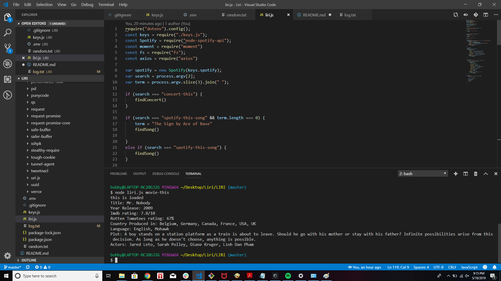

# LIRI
Link to Github for the app source: https://github.com/lov3tt/LIRI

>LIRI App

The Liri app is a CLI App that focus on retrieving information for the clients.

>Feature

1) LIRI can find any bands that's planning to have a concert in the near future, and give the user information on where it's being help and the date for the event.
With the command line node liri.js concert-this "band name".

2) LIRI can find retrive information of a song you know through the spotify API NPM.
Such information include the artist(s) name, a preview of the song, and the album where the song originated from.

3) Other features of LIRI include finding information about a movie, and reading information from a .txt.
